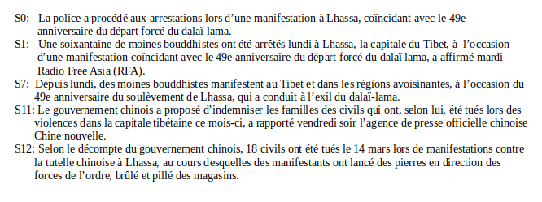
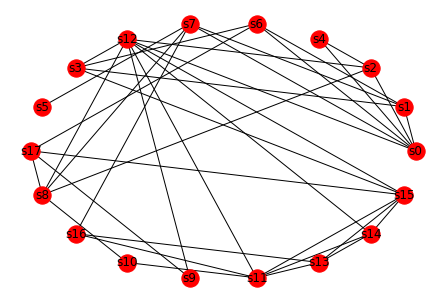

# automatic-summarization-base-on-graph-approch-
automatic summary of French documents using an extraction approach based on a graph method
# Exemple
### Text to be summarize (corpus) :

### Summarization
#### Summary
``` doc  = Sammurization(corpus) 
  my_sum = doc.sumurize() ```
 
 #### Graph
``` doc.graph() ```
 
